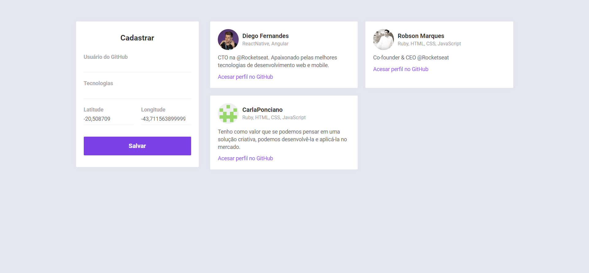

## Be The Hero

## 🎯 Projeto

Projeto desenvolvido durante a Semana OmniStack 10ª Edição organizado pela Rocketseat.

O projeto é um radar de desenvolvedores em que, a partir de um mapa e localização atual, consegue identificar os desenvolvedores mais próximos de acordo com habilidades específicas.

## 🚀 Desenvolvimento
O projeto foi desenvolvido com as seguintes tecnologias: 
* Frontend (web): ReactJS
* Frontend (mobile): React Native
* Backend: NodeJS

## 📚 Algumas das Tenologias Utilizadas

- Banco de dados NoSQL - MongoDB
- Geolocalização
- Consumo de dados da API do GitHub
- Atualizações Real Time

## 💻 Aplicação Web

A aplicação web é voltada para o cadastro dos desenvolvedores a partir do perfil de usuário no GitHub.

<h1 align="center">
     
</h1>

## 📱 Aplicação Mobile

A aplicação mobile é voltada para as consultas de desenvolvedores no mapa de acordo com a localização e habilidades específicas.

<h1 align="center">
    
    
</h1>
